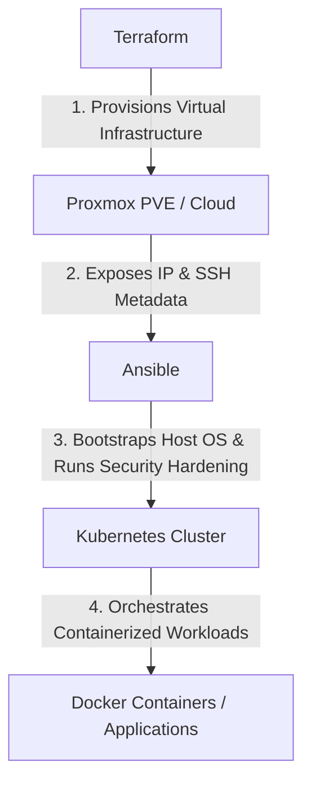

# Integrated End-to-End Labs

This section houses integrated, multi-tool lab guides that demonstrate the synergy between **Terraform**, **Ansible**, and **Kubernetes** to build a modern, fully-automated Platform Engineering pipeline.

---

## Lab Index

| Integrated Lab | Description | Core Integration | Link |
|---|---|---|---|
| **Terraform to Ansible** | Automatically bridging the gap from VM provisioning to configuration management | IP Handoff & Dynamic Inventory | [Terraform to Ansible](./terraform-to-ansible.md) |
| **Terraform to Kubernetes** | Spin up PVE VMs, bootstrap Kubernetes, and deploy native app pods | Infrastructure to App Workload | [Terraform to Kubernetes](./terraform-to-kubernetes.md) |
| **Full Platform Workflow** | High-level conceptual overview mapping PVE hypervisors through the complete lifecycle | Full Architectural Pipeline | [Full Platform Workflow](./full-platform-workflow.md) |

---

## The Automation Stack Paradigm

In a professional Platform Engineering setup, tools should operate in structured, progressive phases. Each tool does what it does best:

1. **Declarative Infrastructure (Terraform)**:
   * **Role**: Provisions VMs, LXCs, networks, storage interfaces, API tokens, and cloud-init blueprints.
   * **Handoff**: Outputs IP addresses, SSH login keys, and device metadata.
2. **Configuration & Bootstrapping (Ansible)**:
   * **Role**: Takes raw machines from Terraform, installs system packages, adjusts kernel settings, enforces security baselines, and bootstraps container engines (like `containerd` or `docker`).
   * **Handoff**: Exposes working clustered hosts or running k3s control planes.
3. **Application Orchestration (Kubernetes)**:
   * **Role**: Declares container specs, scales pods, configures high availability, registers routes, and secures stateful application volumes.
