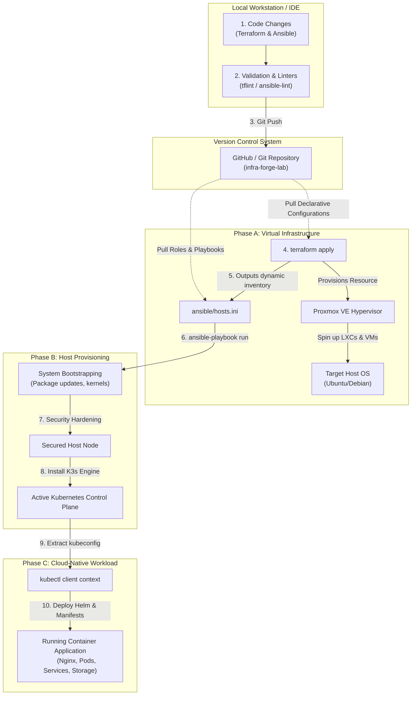

# Comprehensive Platform Engineering Workflow

This document provides a detailed visual diagram and workflow roadmap of the **infra-forge-lab** automation pipeline. It maps files, directories, and tool dependencies to show how they collaborate to form a cohesive, production-style platform.

---

## The End-to-End Automation Pipeline

The flowchart below maps the lifecycle of a deployment, from bare code configuration to a running Kubernetes application:



---

## Directory to Pipeline Phase Mapping

Understanding how our repository folders align to the workflow is crucial for modular expansion:

| Directory | Pipeline Phase | Responsible Utility | Primary Outputs / Artifacts |
|---|---|---|---|
| [`/terraform`](../terraform/README.md) | **Phase A: Infrastructure** | Terraform CLI & Proxmox Provider | VMs, LXC Containers, and generated `ansible/hosts.ini` |
| [`/ansible`](../ansible/README.md) | **Phase B: Configuration** | Ansible Core & Playbooks | Hardened Operating Systems and running K8s clusters |
| [`/kubernetes`](../kubernetes/README.md) | **Phase C: Workloads** | Kubectl CLI & Helm Engine | Running Pods, Services, Ingress Routes, and PVCs |
| [`/scripts`](../scripts/README.md) | **Support Operations** | Bash, Python, and PowerShell | Diagnostic audits, state backups, and cleanup helpers |
| [`/docs`](../docs/troubleshooting.md) | **Knowledge Base** | Markdown & Mermaid Diagrams | Runbooks, troubleshooting keys, and references |

---

## Secrets Management Strategies

Security is critical. In an integrated pipeline, you must ensure secrets are not committed to source control. Use these tool-specific strategies:

### 1. Terraform Secrets
* **Method**: Use a `terraform.tfvars` file that is kept out of Git (listed in `.gitignore`).
* **Example**:
  ```hcl
  pm_api_token_id     = "terraform-prov@pve!token-name"
  pm_api_token_secret = "your-high-security-uuid-string"
  ```

### 2. Ansible Secrets
* **Method**: Use **Ansible Vault** to encrypt host variables or private keys.
* **Example**:
  ```bash
  ansible-vault encrypt ansible/group_vars/all/vault.yml
  ```

### 3. Kubernetes Secrets
* **Method**: Use native Kubernetes Secrets, sealed using Bitnami Sealed Secrets, or injected dynamically using HashiCorp Vault.
* **Example**:
  ```bash
  kubectl create secret generic db-credentials --from-literal=password=SuperSecretText
  ```

---

## Pipeline Failure Points & Mitigations

When a step fails, use this index to isolate the error quickly:

* **Phase A (Terraform) fails**:
  * *Symptom*: API Auth errors, VM cloning failures, resource lockouts.
  * *First Check*: Verify API token scopes, target VM storage size limits, and Proxmox node cluster health.
* **Phase B (Ansible) fails**:
  * *Symptom*: SSH connection timeouts, host-key verification failures.
  * *First Check*: Verify that the output `hosts.ini` IP addresses match real targets, check the SSH key path, and test basic ping.
* **Phase C (Kubernetes) fails**:
  * *Symptom*: Pods stuck in `Pending` or `CrashLoopBackOff` status.
  * *First Check*: Review pod logs (`kubectl logs`) and event descriptions (`kubectl describe pod <pod-name>`). Verify nodes have enough CPU/RAM capacity.
