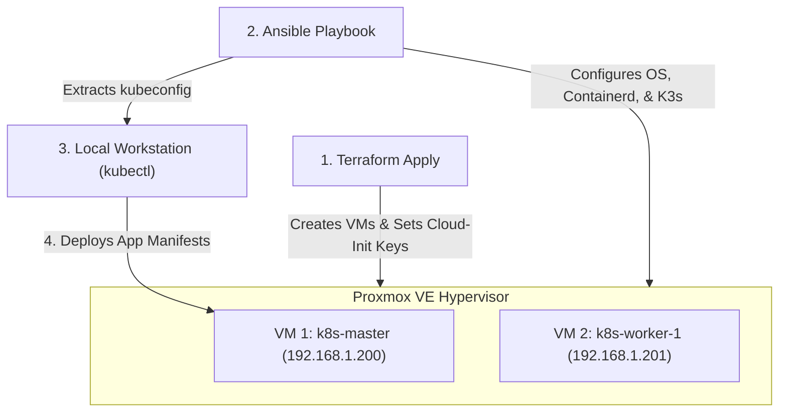

# Integrated Lab: Terraform to Kubernetes (PVE-to-K8s)

This lab details the step-by-step pipeline for provisioning Proxmox virtual resources using **Terraform**, bootstrapping a Kubernetes cluster using **Ansible**, and deploying container workloads using **kubectl**.

---

## Architecture Overview



---

## Phase 1: Infrastructure Provisioning (Terraform)

We declare the VMs on Proxmox using Terraform, setting up our CPU, RAM, and Cloud-Init parameters.

```hcl
# terraform/kubernetes-nodes.tf

resource "proxmox_vm_qemu" "k8s_master" {
  name        = "k8s-master"
  target_node = "pve"
  clone       = "ubuntu-22.04-cloudimage"
  cores       = 2
  memory      = 4096
  
  # Configure disk, network, and Cloud-Init settings
  disk {
    size    = "20G"
    type    = "scsi"
    storage = "local-lvm"
  }
  
  ipconfig0 = "ip=192.168.1.200/24,gw=192.168.1.1"
  sshkeys   = "ssh-rsa AAAAB3NzaC1yc2EAAAADAQABAAABgQ..."
}

resource "proxmox_vm_qemu" "k8s_worker" {
  count       = 2
  name        = "k8s-worker-0${count.index + 1}"
  target_node = "pve"
  clone       = "ubuntu-22.04-cloudimage"
  cores       = 2
  memory      = 2048
  
  disk {
    size    = "20G"
    type    = "scsi"
    storage = "local-lvm"
  }
  
  ipconfig0 = "ip=192.168.1.20${count.index + 1}/24,gw=192.168.1.1"
  sshkeys   = "ssh-rsa AAAAB3NzaC1yc2EAAAADAQABAAABgQ..."
}
```

---

## Phase 2: Host Bootstrapping & Clustering (Ansible)

Once Terraform finishes provisioning the VMs, we use Ansible to install container runtime systems, load kernel modules, and install a lightweight Kubernetes engine like **K3s**.

### Ansible Inventory (`hosts.ini`)
```ini
[master]
k8s-master ansible_host=192.168.1.200

[workers]
k8s-worker-01 ansible_host=192.168.1.201
k8s-worker-02 ansible_host=192.168.1.202

[k8s:children]
master
workers
```

### Ansible Playbook (`k3s-bootstrap.yml`)
```yaml
---
- name: Prep OS Core Settings
  hosts: k8s
  become: true
  tasks:
    - name: Disable Swap (Required for Kubernetes)
      command: swapoff -a
      when: ansible_swaptotal_mb > 0

    - name: Load Network Kernel Modules
      copy:
        dest: /etc/modules-load.d/k8s.conf
        content: |
          overlay
          br_netfilter

- name: Setup Kubernetes Master Node
  hosts: master
  become: true
  tasks:
    - name: Install K3s Control Plane
      shell: curl -sfL https://get.k3s.io | sh -s - --write-kubeconfig-mode 644
      args:
        creates: /etc/rancher/k3s/k3s.yaml

    - name: Retrieve K3s Join Token
      slurp:
        src: /var/lib/rancher/k3s/server/node-token
      register: node_token

- name: Setup Kubernetes Worker Nodes
  hosts: workers
  become: true
  tasks:
    - name: Join Workers to Cluster
      shell: >
        curl -sfL https://get.k3s.io | 
        K3S_URL=https://192.168.1.200:6443 
        K3S_TOKEN={{ hostvars['k8s-master']['node_token']['content'] | b64decode | trim }} 
        sh -
      args:
        creates: /etc/systemd/system/k3s-agent.service
```

---

## Phase 3: Accessing & Controlling the Cluster (kubectl)

After running the Ansible playbook, fetch the cluster configuration file (`kubeconfig`) to manage it from your administrator computer:

### 1. Download the Config File
```bash
scp root@192.168.1.200:/etc/rancher/k3s/k3s.yaml ~/.kube/config-infra-forge
```

### 2. Update the Target IP
By default, the file points to `127.0.0.1`. Open the local file and change the server address to the Master's IP:
```yaml
server: https://192.168.1.200:6443
```

### 3. Test Connection
```bash
export KUBECONFIG=~/.kube/config-infra-forge
kubectl get nodes
```

**Expected Cluster State:**
```bash
NAME            STATUS   ROLES                  AGE   VERSION
k8s-master      Ready    control-plane,master   10m   v1.28.2+k3s1
k8s-worker-01   Ready    <none>                 8m    v1.28.2+k3s1
k8s-worker-02   Ready    <none>                 8m    v1.28.2+k3s1
```

---

## Phase 4: Deploying Workloads

Now that the nodes are connected, deploy an application service onto the running infrastructure.

### 1. Apply Manifests
Deploy your pods and expose them through a service layer:
```bash
kubectl apply -f ../kubernetes/deployments.md
kubectl apply -f ../kubernetes/services.md
```

### 2. Monitor Lifecycle
Verify pods are running across the workers:
```bash
kubectl get pods -o wide
```
